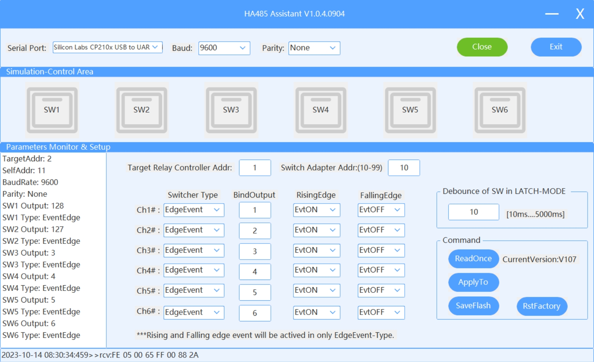

# Esphome KC868-HA Component

# Examples

## An ESP32 board connected to a KC868_HA board
```yaml
external_components:
  - source:
      type: git
      url: https://github.com/hzkincony/esphome-kc868-ha
      ref: v2.0.1

uart:
  - id: myuart1
    tx_pin: 1
    rx_pin: 3
    baud_rate: 9600

kc868_ha:
  target_relay_controller_addr: 1 # Default value is 1, corresponds to the Target Relay Controller Addr parameter in HA485_Ctrl software
  switch_adapter_addr: 10 # Default value is 10, corresponds to the Switch Adapter Addr parameter in HA485_Ctrl software

binary_sensor:
  # The binary_sensor corresponds to the state changes generated by K1~K6 on the KC868 HA board
  # bind_output is required. Corresponds to the BindOutput parameter in HA485_Ctrl software
  # Other parameters refer to: https://esphome.io/components/binary_sensor/index.html
  - platform: kc868_ha
    bind_output: 1 # Corresponds to the BindOutput parameter in HA485_Ctrl software
    name: "binary_sensor 1"
  - platform: kc868_ha
    bind_output: 2
    name: "binary_sensor 2"
  - platform: kc868_ha
    bind_output: 3
    name: "binary_sensor 3"
  - platform: kc868_ha
    bind_output: 4
    name: "binary_sensor 4"
  - platform: kc868_ha
    bind_output: 5
    name: "binary_sensor 5"
  - platform: kc868_ha
    bind_output: 6
    name: "binary_sensor 6"

switch:
  # The switch is used to control the D1~D6 level output on the KC868 HA board
  # bind_output is required. Corresponds to the BindOutput parameter in HA485_Ctrl software
  # Other parameters refer to: https://esphome.io/components/switch/index.html
  - platform: kc868_ha
    bind_output: 1
    name: "switch 1"
  - platform: kc868_ha
    bind_output: 2
    name: "switch 2"
  - platform: kc868_ha
    bind_output: 3
    name: "switch 3"
  - platform: kc868_ha
    bind_output: 4
    name: "switch 4"
  - platform: kc868_ha
    bind_output: 5
    name: "switch 5"
  - platform: kc868_ha
    bind_output: 6
    name: "switch 6"
```


## An ESP32 board connected to a KC868_HA board with modified KC868_HA parameters
```yaml
external_components:
  - source:
      type: git
      url: https://github.com/hzkincony/esphome-kc868-ha
      ref: v2.0.1

uart:
  - id: myuart1
    tx_pin: 1
    rx_pin: 3
    baud_rate: 9600

kc868_ha:
  target_relay_controller_addr: 2 # Default value is 1, corresponds to the Target Relay Controller Addr parameter in HA485_Ctrl software
  switch_adapter_addr: 11 # Default value is 10, corresponds to the Switch Adapter Addr parameter in HA485_Ctrl software

binary_sensor:
  # The binary_sensor corresponds to the state changes generated by K1~K6 on the KC868 HA board
  # bind_output is required. Corresponds to the BindOutput parameter in HA485_Ctrl software
  # Other parameters refer to: https://esphome.io/components/binary_sensor/index.html
  - platform: kc868_ha
    bind_output: 121 # Corresponds to the BindOutput parameter in HA485_Ctrl software
    name: "binary_sensor 1"
  - platform: kc868_ha
    bind_output: 122
    name: "binary_sensor 2"
  - platform: kc868_ha
    bind_output: 123
    name: "binary_sensor 3"
  - platform: kc868_ha
    bind_output: 124
    name: "binary_sensor 4"
  - platform: kc868_ha
    bind_output: 125
    name: "binary_sensor 5"
  - platform: kc868_ha
    bind_output: 126
    name: "binary_sensor 6"

switch:
  # The switch is used to control the D1~D6 level output on the KC868 HA board
  # bind_output is required. Corresponds to the BindOutput parameter in HA485_Ctrl software
  # Other parameters refer to: https://esphome.io/components/switch/index.html
  - platform: kc868_ha
    bind_output: 121
    name: "switch 1"
  - platform: kc868_ha
    bind_output: 122
    name: "switch 2"
  - platform: kc868_ha
    bind_output: 123
    name: "switch 3"
  - platform: kc868_ha
    bind_output: 124
    name: "switch 4"
  - platform: kc868_ha
    bind_output: 125
    name: "switch 5"
  - platform: kc868_ha
    bind_output: 126
    name: "switch 6"
```


## An ESP32 board connected to multiple KC868_HA boards
```yaml
external_components:
  - source:
      type: git
      url: https://github.com/hzkincony/esphome-kc868-ha
      ref: v2.0.1

uart:
  - id: myuart1
    tx_pin: 1
    rx_pin: 3
    baud_rate: 9600

kc868_ha:
  - id: kc868_ha_1 # Define the first KC868 HA board
    target_relay_controller_addr: 1
    switch_adapter_addr: 10
  - id: kc868_ha_2 # Define the second KC868 HA board
    target_relay_controller_addr: 1
    switch_adapter_addr: 11

binary_sensor:
  - platform: kc868_ha
    kc868_ha_id: kc868_ha_1 # Corresponds to the first KC868 HA board
    bind_output: 1
    name: "binary_sensor 1"
  - platform: kc868_ha
    kc868_ha_id: kc868_ha_1
    bind_output: 2
    name: "binary_sensor 2"
  - platform: kc868_ha
    kc868_ha_id: kc868_ha_1
    bind_output: 3
    name: "binary_sensor 3"
  - platform: kc868_ha
    kc868_ha_id: kc868_ha_1
    bind_output: 4
    name: "binary_sensor 4"
  - platform: kc868_ha
    kc868_ha_id: kc868_ha_1
    bind_output: 5
    name: "binary_sensor 5"
  - platform: kc868_ha
    kc868_ha_id: kc868_ha_1
    bind_output: 6
    name: "binary_sensor 6"
  - platform: kc868_ha
    kc868_ha_id: kc868_ha_2 # Corresponds to the second KC868 HA board
    bind_output: 7
    name: "binary_sensor 7"
  - platform: kc868_ha
    kc868_ha_id: kc868_ha_2
    bind_output: 8
    name: "binary_sensor 8"
  - platform: kc868_ha
    kc868_ha_id: kc868_ha_2
    bind_output: 9
    name: "binary_sensor 9"
  - platform: kc868_ha
    kc868_ha_id: kc868_ha_2
    bind_output: 10
    name: "binary_sensor 10"
